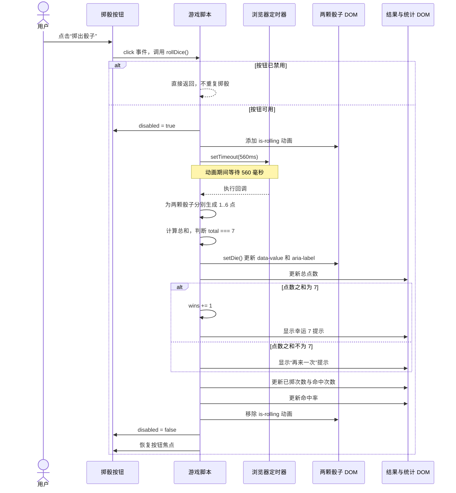

# 掷出幸运 7：UML 顺序图

此图描述用户点击“掷出骰子”后，程序掷出两颗骰子、判断点数之和并更新页面的过程。

```mermaid
sequenceDiagram
    actor User as 用户
    participant Button as 掷骰按钮
    participant Game as 游戏脚本
    participant Timer as 浏览器定时器
    participant Dice as 两颗骰子 DOM
    participant Panel as 结果与统计 DOM

    User->>Button: 点击“掷出骰子”
    Button->>Game: click 事件，调用 rollDice()

    alt 按钮已禁用
        Game-->>Game: 直接返回，不重复掷骰
    else 按钮可用
        Game->>Button: disabled = true
        Game->>Dice: 添加 is-rolling 动画
        Game->>Timer: setTimeout(560ms)
        Note over Game,Timer: 动画期间等待 560 毫秒
        Timer-->>Game: 执行回调

        Game->>Game: 为两颗骰子分别生成 1..6 点
        Game->>Game: 计算总和，判断 total === 7
        Game->>Dice: setDie() 更新 data-value 和 aria-label

        Game->>Panel: 更新总点数
        alt 点数之和为 7
            Game->>Game: wins += 1
            Game->>Panel: 显示幸运 7 提示
        else 点数之和不为 7
            Game->>Panel: 显示“再来一次”提示
        end

        Game->>Panel: 更新已掷次数与命中次数
        Game->>Panel: 更新命中率
        Game->>Dice: 移除 is-rolling 动画
        Game->>Button: disabled = false
        Game->>Button: 恢复按钮焦点
    end
```

> **说明：** 参与者“游戏脚本”对应当前 `script.js` 中的函数和模块级状态，不是实际声明的 JavaScript 类。
